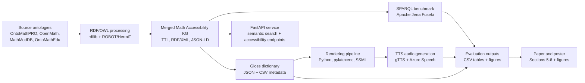

# MathOntoSpeak Tools and Software Flow

This document summarizes the software pipeline behind the evaluation and poster figures.

## Tool Roles

| Stage | Main tools/software | Project artifacts |
|---|---|---|
| Ontology integration | RDF/OWL, rdflib, ROBOT, HermiT | `ontologies/merged/math_accessibility_kg_merged_gloss.ttl` |
| Knowledge graph query | Apache Jena Fuseki, SPARQL | `reports/sparql/week3_fuseki_query_results_mathkg500.csv` |
| Gloss and perspective metadata | Python, JSON, CSV | `gloss/week3_gloss_dictionary.json` |
| Speech rendering | Python, pylatexenc, SSML | `src/mathontospeak/`, `outputs/ssml/` |
| Audio generation | gTTS, Azure Speech | `reports/audio/`, `study/audio/` |
| API layer | FastAPI, Uvicorn | `api/main.py`, `api/services.py` |
| Evaluation analysis | Python, SciPy, openpyxl, Matplotlib | `reports/evaluation/`, `figures/` |
| Paper/poster writing | Markdown, PNG/SVG figures | `paper/section_5_evaluation.md`, `paper/section_6_discussion.md` |

## Poster Takeaway

The system is not only a TTS script. It is a linked-data workflow: source ontologies are merged into a provenance-tagged knowledge graph, the graph supports SPARQL/API lookup, and each concept can be rendered through multiple surface-form perspectives for accessible speech.
